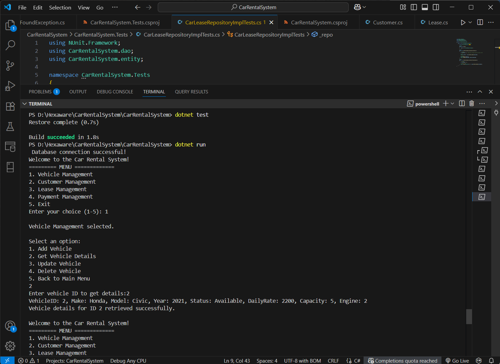

# Car Rental System 🚗

A complete C# console-based application for managing a car rental system.  
This project was developed as part of a **case study/training assignment** to demonstrate the use of:

- C# Object-Oriented Programming
- ADO.NET for database access
- SQL Server (LocalDB)
- NUnit for unit testing

---

## 🛠 Features

### 1. Vehicle Management
- Add, View, Update, and Delete Vehicles

### 2. Customer Management
- Add, View, Update, and Delete Customers

### 3. Lease Management
- Create and manage lease agreements

### 4. Payment Management
- Add, View, Update, and Delete Payment records

---

## 🧪 Testing

Unit testing is implemented using:
- **NUnit**
- **NUnit3TestAdapter**
- **Microsoft.NET.Test.Sdk**

## Run tests with:

```bash
dotnet test
```

---

## 🖼️ **Sample Screenshot**
Here is a screenshot of the console UI:


---

## 📁 **Tech Stack**
#### Language: C#
#### IDE: Visual Studio Code / Visual Studio
#### DB: SQL Server (LocalDB)
#### Testing: NUnit

---

## 📌 **Author**
####  **Yohini K**
####  Full Stack Developer | C# | SQL | ADO.NET | NUnit
####  📍 Tamil Nadu, India
####  📧 yohinikandavel11@gmail.com

---

## 📄 **License**
This project is for academic/training use only.
